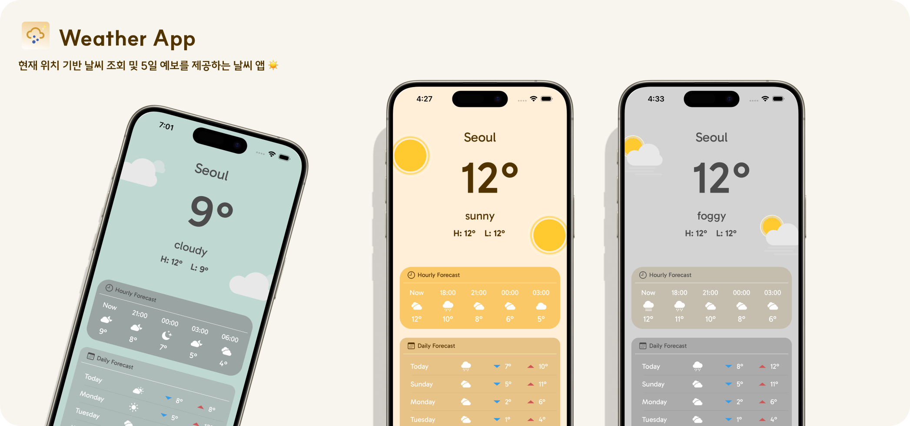

## ☀️ WeatherApp

> 현재 위치 기반 실시간 날씨 및 5일 예보를 제공하는 iOS 앱
> 
> 
> MVVM + Combine 아키텍처 기반으로 제작된 개인 프로젝트입니다.
> 



### 📆 개발 기간

25.02 ~ 25.03 (약 6주, 개인 프로젝트)

---

## 🔨 사용 기술

| Category | Stack |
| --- | --- |
| Language | `Swift` |
| Architecture | `MVVM` |
| UI Framework | `UIKit` + `SnapKit`|
| 비동기 처리 | `Combine` |
| 위치 정보 | `CoreLocation` |
| Networking | `Alamofire`, `URLSession`, `RESTful API` |
| API | `OpenWeatherAPI` |

---

## 🌈 주요 기능

- **🌤 실시간 날씨 조회**
    - OpenWeather API 활용, 현재 날씨와 지역 기반 정보 표시
- **📍 위치 기반 날씨 정보**
    - CoreLocation을 통한 현재 위치 자동 감지
- **🧠 MVVM + Combine 적용**
    - ViewModel에서 Combine을 통한 데이터 스트림 처리
- **📅 5일 예보**
    - 3시간 단위 및 요일별 날씨 데이터를 가공해 Section별로 UI 출력
- **🎨 날씨별 테마**
    - 날씨 상태(맑음, 비, 눈 등)에 따라 앱 테마 이미지 / 배경 변경
- **🗓 날짜 필터링**
    - `DateFormatter` + Extension으로 날짜 계산 및 변환 처리

---


## 🚀 실행 방법

1. 이 저장소를 클론합니다.

```bash
git clone https://github.com/yyujnn/WeatherApp.git
```

2. `OpenWeatherInfo` 에 API 키를 등록해 주세요:

```swift
<key>WeatherAPIKey</key>
<string>YOUR_API_KEY</string>

```

3. 라이브러리 설치 (`Alamofire` , `Lottie` ,`Snapkit` 등)

---

## 👩🏻‍💻 개발자

- 정유진 ([@github](https://github.com/yyujnn))  | iOS Developer
